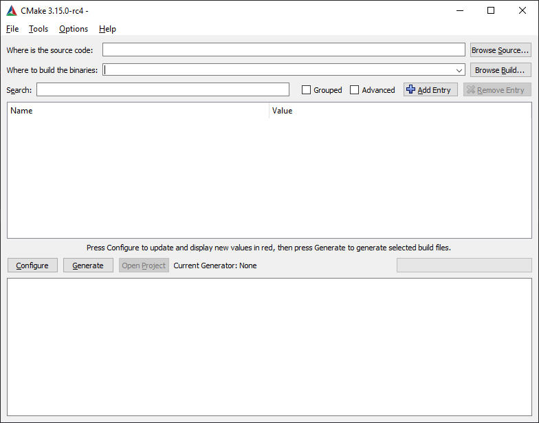
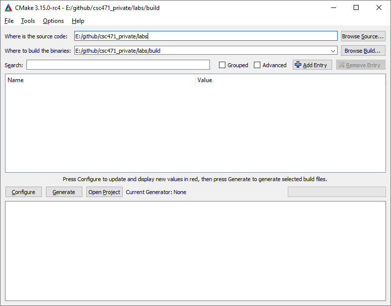
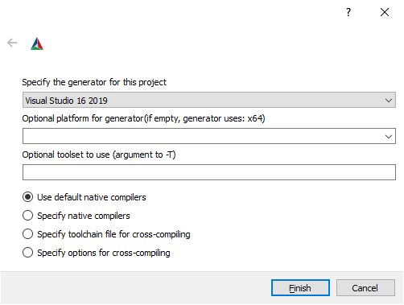
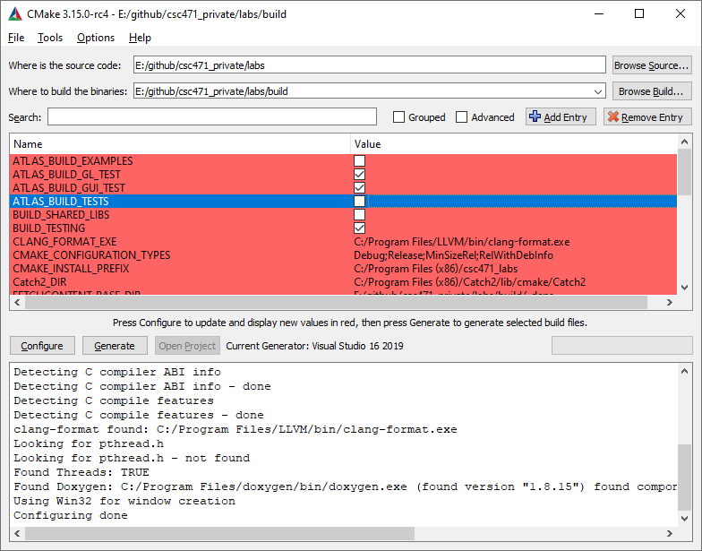
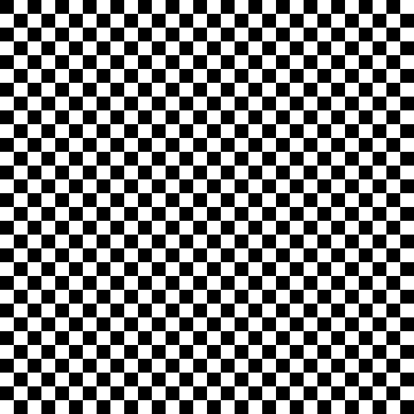

# CSc 305 Lab 1: Checkerboard

## Introduction

The purpose of this lab is to get you acquainted with C++ and Atlas, which is
the library that we will be using in this course for all labs and assignments.
We will first walk through the CMake setup to build our code, and then we will
write a simple program that generates a checkerboard pattern image.

## CMake

Atlas uses CMake to simplify the generation of build files across different
environments and platforms. The lab computers are already correctly configured
to run Atlas. If you wish to run Atlas on your own machine please see the
relevant documentation or contact the instructor. It is important to note that
Atlas **does not** support macOS in any way.  Documentation for Atlas can be
found [here](https://marovira.github.io/atlas/).

To get started, clone the lab code. You may do this with the following command
line instructions:

```sh
cd path\to\your\dir
git clone https://github.com/marovira/csc305_spring2020_labs.git labs
```

> **Note:** It is recommended that you save all your work on your `H:` drive.

After the code has finished downloading, open the CMake GUI. It is possible to
build from the command line, but using the UI is simpler in this case. You
should see a window like this:



First, set the path to the directory where you downloaded the code under "Where
is the source code:". Next, copy this directory and paste it into "Where to
build the binaries", appending "/build". Once you're done, you should have
something like this:



If everything is setup, click "Configure". You should be greeted with a prompt.
Make sure that the settings match those shown below and click "Finish".



Once CMake is done (note that it may take some time as it must also download all
the libraries that Atlas uses), you will see all of the build options displayed
in red. Before proceeding, make sure you disable the following options:

* `ATLAS_BUILD_EXAMPLES`
* `ATLAS_BUILD_TESTS`
* `GLFW_BUILD_DOCS`
* `GLFW_BUILD_EXAMPLES`
* `GLFW_BUILD_TESTS`

Once you're done, you should have something similar to the image shown below. If
so, click "Generate".



Once everything is done, click "Open Project", which will open the Visual Studio
solution.

## Making a Checkerboard Pattern

Before we begin writing code, right-click on `lab_01_intro` and choose "Set as
Startup Project" from the context menu. This will make it so that you only build
the lab code (and any necessary dependencies). Now click on `main.cpp` so we can
start writing some code. You will notice that the file already contains a
function to write the image to file. You will be using this same function in
your assignments. The alias for `Colour` is also already provided as seen in
class. 

Your task is the following: write a C++ main function that generates a 600x600
checkerboard pattern like the one shown below. The squares have dimensions
20x20. You should declare a `std::vector` of `Colour` to hold the pixels, and
use loops similar to the ones seen in class to populate it. Once you have this
code ready, simply use `saveToFile` with the corresponding parameters and
compile and run your code. The file will be placed in
`path/to/your/dir/build/labs/lab_01_intro/your_name.bmp`


