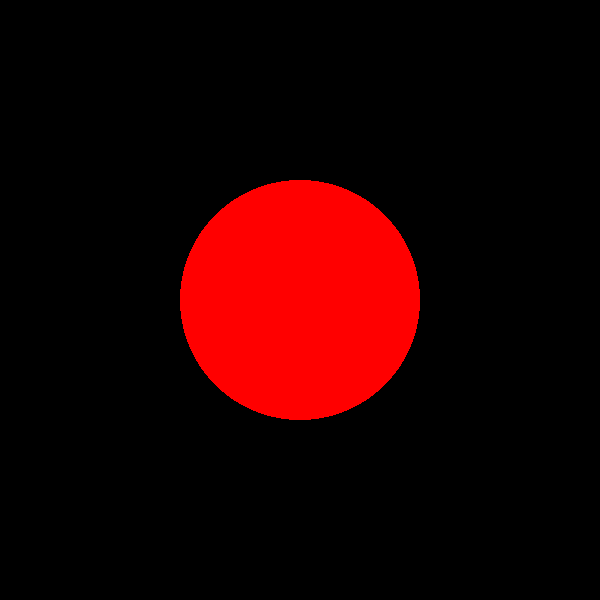

# CSc 305 Lab 2: Ray tracing a Sphere

## Introduction

The purpose of this lab is to build the foundation for the ray tracer you will
need to write for the assignment by guiding you through the process of designing
and implementing a bare-bones ray tracer that can render a single sphere and
save it to file. We will first discuss what capabilities are already available
within Atlas, and then we will discuss the general structure of the ray tracer.
Once we have all of this ready, we will implement the ray tracer itself.

## Available Functionality

Atlas bundles a math library called GLM which will handle the implementation
details of anything related to matrix and vector algebra. Atlas itself provides
aliases for most common types (all found under the `atlas::math` namespace) such
as:

* Vectors: `Vector`, `Vector2`, `Vector4`,
* Points: `Point`, `Point2`, `Point4`, and
* Normals: `Normal`, `Normal2`, `Normal4`.

Note that in all cases, the first type is an element of 3D space.

Through GLM, we also have access to all the common math operators. We can add,
subtract, and multiply any of the above types using the standard operators as if
they were fundamental types like integers or floats. In order to use
vector-specific functions such as the dot and cross product, we use:

* Dot product: `glm::dot`
* Cross product: `glm::cross`
* Normalize: `glm::normalize`
* Length: `glm::length`

You can find out the complete list of functions that GLM provides by reading the
corresponding documentation
[here](https://github.com/g-truc/glm/blob/master/manual.md).

Additionally, Atlas provides a ray object specifically designed for ray tracing
applications. The class is defined in the header `atlas/math/Ray.hpp` and can be
used as follows:

```c++
atlas::math::Ray<atlas::math::Vector> ray;
ray.o = {0, 0, 0};                  // Sets origin of ray to be (0, 0, 0)
ray.d = {0, 0, -1};                 // Sets direction of ray to be (0, 0, -1)
atlas::math::Vector p = ray(1.0f);  // Evaluate ray equation at t = 1
```

Now that we are familiar with the functionality that Atlas provides, we can
proceed to discuss the structure of our ray tracer.

## A Bare-Bones Ray Tracer

Fundamentally, all that the ray tracer has to do is iterate over every pixel on
the image and cast rays into the scene checking for their intersection. If the
ray intersects, we then need to retrieve some information regarding the
intersection (such as the value of `t` for which the ray intersects, or the
colour) and then perform some operations on it to produce the final colour of
the pixel. With this in mind, we first turn our attention to the object that we
wish to render: a sphere.

Before we decide on an implementation, we first need to decide what
functionality will be handled by the sphere. In particular, we need the
following:

1. The origin and radius of the sphere. By the same token, we may also want to
   have the squared radius, as we use it often in our calculations.
2. A function that takes a ray and decides whether the it intersects or not.
   Moreover, that function should be able to return more information beyond
   whether the ray intersects. We will also need:
    1. The colour of the surface,
    2. The value of `t` for which the ray intersects.

With these elements defined, we are now ready to begin implementing our ray
tracer.

## C++ Classes and Structs

At a high level both classes and structs are constructs used for packaging related
data and operations together. For a given `class` or `struct`, the variables it
holds are called **data members** and its operations are called **function members**.
The following is an example of a `class` cribbed from
[CSC116 Lab 6](https://github.com/billbird/116f19_Labs/tree/master/Lab06#classes-in-c):

```c++
#include <iostream>

class Counter
{
public:
    // Default constructor, initialize c to 0
    Counter() : c {0}
    {}

    // Custom constructor, initialize c to initial_count
    Counter(int initial_count) : c {initial_count}
    {}

    // This will construct a copy object of the argument Counter
    Counter(Counter const& other) : c {other.c}
    {}

    // Destructor, executed automatically when class object exits scope
    // This destructor could be excluded because all data members are primitive
    ~Counter() {};

    // Return counter value.
    int count() const { return c; }

    // Increment counter, then return new value
    int increment() { return ++c; }

    // Reset counter to 0
    void reset() { c = 0; }

private:
    // Variables and functions under private can only be accessed
    // within the classes functions
    int c;
};
```

Classes are defined with the `class <name> { ... };` syntax, likewise structs are
defined with `struct <name> { ... };`. Inside the `Counter` class body are two
specifiers `public` and `private` (`protected` also exists). These are access
specifiers which define whether the members following the specifier can be accessed
outside the scope of the class. Without having an access specifier stated, `class`
members are default `private` and `struct` members are default `public`.

Class constructors are function members which have the same name as the class and
no return type. Constructors can have an initializer list, `: <data0>{var0}, ... <dataN>{varN}`,
before the class body. The initializer list is used to initialize data members
before the constructor body is executed. If a constructor does nothing then it can
be excluded. There are special constructors as well, like the **copy constructor**
which takes the form: `<name>(<name> const& x)`. Copy constructors are meant to return
a copy of the argument object passed to them.

A class destructor is a function member which have a tilde then the same name as the
class and no return type: `~<name>()`. Destructors are invoked automatically on a
class object when it becomes no longer accessible in a program. If a class is only
composed of primitive data types, the destructor may be excluded. There can only be
one destructor for a class.

If a function member does not modify class data members, it should be specified as
`const` like the `count` function. This allows the function to be invoked on `const`
objects of the class.

## Basic C++ Pass-By Symantics

By default, everything is essentially passed-by-value. A function like the following
which receives the two `Counter` objects by value:

```c++
int add_counts(Counter c0, Counter c1)
{
    return c0.count() + c1.count();
}
```

This means that when `add_counts` is called, `c0` and `c1` are constructed in the
function's scope using the two argument `Counter` objects. `c0` and `c1` are constructed
using the copy constructor of `Counter`. However, there is no reason that `add_counts`
requires unique copies of the `Counter` object provided to it as arguments.

Instead, we should pass the `Counter` objects by reference to avoid having to construct
two new `Counter` objects in `add_counts`'s scope. We can tell the compiler to pass-by-reference
by appending `&` to individual parameter types. This allows the programmer to have complete
control over how data moves through out their program. Here is `add_counts` utilizing
pass-by-reference symantics:

```c++
int add_counts(Counter& c0, Counter& c1)
{
    return c0.count() + c1.count();
}
```

The function `add_counts` does not modify its argument's data. It simply reads a
data member. If a programmer were to call the function with `const Counter` objects,
the compiler would complain because `add_counts` takes mutable references to its
arguments. Because the function does not mutate the argument objects, the function
parameters should be passed by constant reference, `const&`, like the following:

```c++
int add_counts(Counter const& c0, Counter const& c1)
{
    return c0.count() + c1.count();
}
```

A general rule-of-thumb, if the function does not modify the object it takes as a
reference, it should be passed as a `const&`. Only `const` member functions, like
`count`, may be called on `const` class objects. This is why it is important that
function members which do not mutate the object be specified as `const`.

## Implementation

Before we write the code for the sphere, let's write a quick `struct` that will
hold the intersection data. We will call it `ShadeRec` and will be defined in
`labs.hpp` and will contain the following data:

* The colour of the surface at that point,
* The value of `t`.

Once we have this, we can now implement the sphere class. It will contain:

* The radius, radius squared, and centre of the sphere.
* A function that will have as parameters the ray passed by `const&`, and a
  reference to a `ShadeRec` object to fill in. The function will return true if
  the ray intersects, and false otherwise.

Once you have all of this written, you can now write the two nested loops to
iterate over every pixel in the image. For each pixel, compute the centre of the
pixel and set it as the origin of the ray. The direction of the ray we can
assume is constant and set to (0, 0, -1). Once you have the ray computed, invoke
the `hit` function from the sphere class and check if we hit the sphere. If we
did, then grab the colour and assign it to the current pixel. Once all pixels
have been filled, we can save the file to disk. If everything is done correctly,
you should end up with an image like the one shown below. The sphere shown is
centred at the origin and has radius 120.


