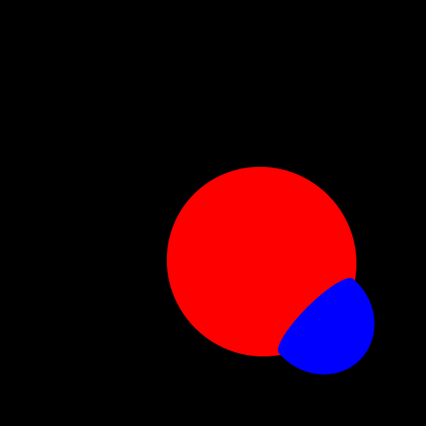
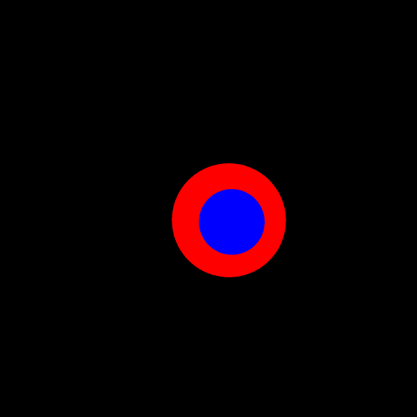

# CSc 305 Lab 3: Using a Pinhole Camera

# Introduction

The purpose of this lab is to continue building our ray tracer by adding a
pinhole camera as discussed in the lectures. We will also discuss the way the
code will be designed, as well as setup the basic interfaces that future classes
will be based on. Since we are going to be ray tracing more complex scenes, we
will also discuss an implementation for random sampling.

We will first discuss the `Random` class contained in Atlas as it will be the
backbone of the random sampling system. Then we will discuss the design for our
code moving forward, and finally we will implement the pinhole camera.

## The `Random` Class

Atlas provides a random number generator, which is located in the header
`atlas/math/Random.hpp`. To declare a random generator, we will use the
following:

```c++
atlas::math::Random<float> engine;
```

Random sampling relies on generating random numbers in the range [0, 1]. We will
therefore use the corresponding function:

```c++
float sample = engine.getRandomOne();
```

## Ray Tracer Design

In order to simplify coding, we will define a common interface that all objects
must implement in our code. In particular, we will define the following
interfaces and entities:

* `Shape`: this will be the interface that all of our primitives will use. It
  must contain a function to intersect with a ray, as well as have a way of
  setting and retrieving the colour of the object. All classes inheriting from
  `Shape` must define two functions `hit` and `intersectRay`. `hit` has the
  same definition from Lab 2. `intersectRay` is a helper function to `hit`,
  which is used to determine if the ray intersects the entity. The `ShadeRec&`
  given to `hit` must only change the data (both `t` and `color`) if the ray
  intersects and the computed `t` is less than the `t` in the `ShadeRec&`.
* `Camera`: this will be used by the different types of cameras we may want to
  use. The main special function for this camera will be a function to render
  the scene, as it is more convenient to move the dual loops into it so that all
  computations can be done in camera space. In addition, we will add a function
  to set all the relevant parameters as well as to compute the UVW-space.
* `Sampler`: this will be the interface that all multi-sampling technique
  implementations will use. A class inheriting from `Sampler` must call
  `generateSamples` which will create data used to sample a pixel. It will also
  provide a function used during rendering to `sampleUnitSquare`, which will
  return sample data to offset the pixel.
* `Sphere`: this class is a derived class from `Shape` and it fully implements
  `hit` and `intersectRay`. Read those two functions to prove to your self that
  the closest `Sphere` to the `Camera` will have its color used by the sample.
* `World`: this struct wraps a number of core pieces of data including the scene
  objects, `Sampler` used, image vector, background color, and image height/width.

With these interfaces defined, we can begin implementing the ray tracer. First, however,
some C++ information you'll need for this lab.

## C++ Object Oriented Programming

C++ is an object oriented programming language, and as such supports OOP features
like inheritance, polymorphism, and abstract classes. We will leverage OOP
features in our ray tracer to extend support to multiple shapes, cameras, and
sampling techniques. The following is a basic example of OOP in C++ for reference
cribbed from [CSC116 Lab 8](https://github.com/billbird/116f19_Labs/tree/master/Lab08/solution_code):

```c++
#include <cmath>

class Shape2D
{
public:
    Shape2D() = default;
    virtual ~Shape2D() = default;

    virtual float area() const = 0;
};

class Rectangle : public Shape2D
{
public:
    Rectangle(float height, float width) :
        height_{ height }, width_{ width }
    {}

    float area() const
    {
        return height_ * width_;
    }

protected:
    float height_, width_;
};

class Square : protected Rectangle
{
public:
    Square(float side_length) :
        Rectangle{ side_length, side_length }
    {}

    float diagonal_length() const
    {
        return height_ * sqrt_2;
    }

private:
    float sqrt_2{ std::sqrt(2.0f) };
};
```

### Inheritance

Inheritance is the concept that classes, _derived_ classes, can be extended
from another class, the _base_ class. The derived class will have the functionality
of the base class along with functionality unique to the derived class.

In C++, there are three inheritance modes `public`, `protected`, and `private` which
correspond with the three access specifiers, [discussed in Lab 2](https://github.com/marovira/csc305_spring2020_labs/tree/master/labs/lab02_sphere#c-classes-and-structs).
The inheritance mode a class derives a base class from defines the level of access
the derived class has to the members of the base class. In the example `Square` has
`protected` inheritance of `Rectangle`, so it has access to the data member `height_`
(see `diagonal_length`). The syntax for inheritance in C++ is:

`class <derived class> : <access specifier> <base class0>, ... , <access specifier> <base classN>`

The `<access specifier>` may be omitted in which case the default inheritance mode
is `public`. As you can see in the syntax, C++ supports multiple inheritance allowing
a derived class to have multiple base classes.

### Polymorphism

Polymorphism is the behavior in which a derived class may be used as in instance of its
base class(es). The following code example shows how polymorphism and the _is a_ relation
can be used:

```c++
#include <iostream>
#include <memory>
#include <vector>

// more on std::shared_ptr in a following section (conceptually treat it as a pointer)
std::vector<std::shared_ptr<Shape2D>> shape_vec{};

for (size_t i{ 0 }; i < 4; ++i) {
    for (size_t j{ 0 }; j < 4; ++j) {
        if (i == j) {
            shape_vec.push_back(std::make_shared<Square>(Square{ i }));
        } else {
            shape_vec.push_back(std::make_shared<Square>(Rectangle{ i , j}));
        }
    }
}

for (auto const& s : shape_vec) {
    std::cout << s.area() << '\n';
}
```

In the example because both `Rectangle` and `Square` are derived from
`Shape2D`, both can be pushed into the `std::vector<std::shared_ptr<Shape2D>>`.
However, the usable functionality of the objects in the vector are restricted
to the functionality of `Shape2D`. Due to C++ symantics, use of polymorphism
must be performed through pointers rather than the concrete objects. Polymorphism
is not just theoretical flourish, it is critical to designing extensible systems.

### Abstract Classes

Not all classes defined in a C++ program may be instantiated into a concrete object.
Some classes exist for the purpose of defining a set of functionality which deriving
classes must implement, these are called _abstract classes_. By definition, an
abstract class is any class with one or more pure virtual function members. A
_pure virtual_ function member is a function member which is only a function
declaration with no associated definition. Pure virtual function members take the form:

`virtual <return type> <function name>(<params>) <cv-specifier> = 0;`

The `Shape2D` class is an example of an abstract class, because the `area` function
member is pure virtual. A consequence of this is that `Shape2D` may not be constructed
in a program. Instead, classes, like `Rectangle`, may inherit from `Shape2D`. All
deriving classes may be accumulated and used regardless of the type of the base
class (see the polymorphism example).

Alongside pure virtual function members, there are also _virtual_ function members.
The difference between the two is that a virtual function member has an associated
definition, which may be overridden by deriving classes (where non-virtual function
members can not).

## Memory Management with `std::shared_ptr`

How memory is managed in C++ is one of the primary differences between the C++ and
a language like C. In modern C++, raw pointers should _never_ be used. Instead,
[_smart pointers_](https://en.cppreference.com/w/cpp/memory) and [_RAII_ techniques](https://en.cppreference.com/w/cpp/language/raii) should be used to guarantee leak free programs
while having the benefit of no runtime garbage collection all while running on the
bare metal CPU.

A smart pointer is a class which is responsible for managing the lifetime and access
to some resource, called the _managed object_. For the purposes of this lab we're
concerned with [`std::shared_ptr`](https://en.cppreference.com/w/cpp/memory/shared_ptr),
which maintains shared ownership to its managed object. A `std::shared_ptr` allows a
programmer to share ownership of an object across a system with the guarantee that the
managed object will not be destructed until no more references to the object exist.
The following code example show the basic usage of `std::shared_ptr`.

```c++
#include <memory>

int main()
{
    // constructs std::shared_ptr<int> object which has no managed object
    std::shared_ptr<int> sp0{};

    // std::make_shared allocates and constructs a managed object of type int
    // sp0 is then provided the managed object
    sp0 = std::make_shared<int>{ 1985 };

    {
        // creates a new std::shared_ptr with the same managed object as sp0
        std::shared_ptr<int> sp1 = sp0;
        // the managed object's value is change (this change is visible in sp0)
        *sp1 = 2020;
        // on exit of this scope sp1 is destructed, but the managed object is not
    }

    // sp0 is destructed, as well as the managed object
    return 0;
}
```

For more information on `std::shared_ptr`, other smart pointers, and memory
management differences between C++ and C, have a read of the [CSC116 Lab 9](https://github.com/billbird/116f19_Labs/tree/master/Lab09) writeup.

## Implementation

With the exception of the Pinhole camera itself, much of the other code should
be very familiar from assignment 1. Primitives like `Sphere` must be converted
to inherit from the interface `Shape`, and then must be used in a polymorphic
way (`std::shared_ptr` will be needed for this).

The `Sampler` interface is defined in a way to be easy to use in the rendering
step. Within the rendering loop over the image, it simply requires calling
`sampleUnitSquare` which returns a `Point` which will be added to offset the
pixel. Afterward offsetting the pixel and creating a ray from the sample point,
you'll check for hits on the scene objects.

The `hit` function defined by the `Shape` interface should be passed a `ShadeRec&`.
This object is updated only if the `ray` hits and the computed `t` is less than
existing `t` in the `ShadeRec&`. The update step replaces the `t` and `Colour`.
At the end of each sampling, the `Colour` should be aggregated, such that after
sampling is finished the `Colour` of the pixel can be taken from the average color.

You may find the interfaces initially tedious to get working, but these structures
will simplify future assignments and labs and allow you to create a more extensible
ray tracer supporting many primitives, samplers, and cameras.

Note: for faster render times, in Visual Studio change from "Debug" mode to "Release" mode.

On completion of this lab, you'll be able to move around the scene rendering different
perspectives like the following pictures:




