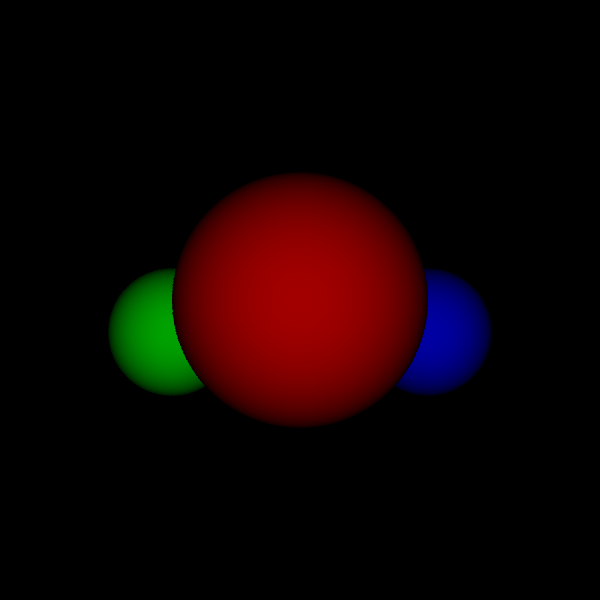

# CSc 305 Lab 4: Implementing Diffuse Shading

# Introduction

The purpose of this lab is to continue building our ray tracer by adding diffuse
shading and directional lighting as discussed in the lectures. We will also
discuss the way the code will be designed, as well as setup the basic interfaces
that future classes will be based on. Note that the lab uses random and regular
sampling, which may not be ideal for this type of rendering.

## Ray Tracer Design

This lab uses most of the infrastructure code from Lab 3, with the exception of
the cameras. In this lab you'll be responsible for implementing the following
classes:

1. The `BRDF` class,
2. the `Material` class,
3. the `Light` class.

The three classes above are provided as interfaces in the `lab.hpp` file. Along
with implementing the non-virtual member functions of the three interfaces, you
must implement concrete classes of the interfaces: `Lambertian`, `Matte`,
`Directional`, and `Ambient`. No new C++ content is covered in this lab.

## Implementation

A number of the functions in the interfaces have parameters which are not required
for all implementations of the functions. For example, the `Lambertian::f` will
not require the `ShadeRec` or `Vector` parameters. Visual Studio's compiler by default
will treat unused parameters as errors, to avoid this in the implementation of the
function add the compiler pragma `[[maybe_unused]]` in front of each unused parameter.

The `shade` function of the `Material` is where the `BRDF` and `Light` functions come
together to create the shaded color of the surface. In the Lab 3 the average pixel
color was taken directly from the `ShadeRec`. When taking into account directional
lighting and material the sampling step should instead pass the `ShadeRec` to the
`shade` function of the hit material to determine the color to be added to the accumulator.

With the ray tracer created in this lab, you will be able to render scenes with
simple lighting like the render below:

